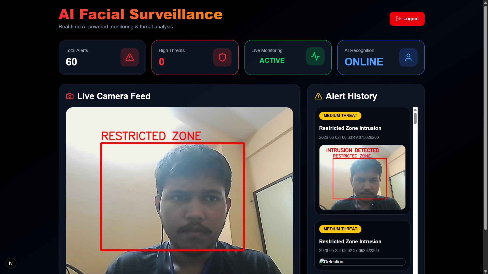
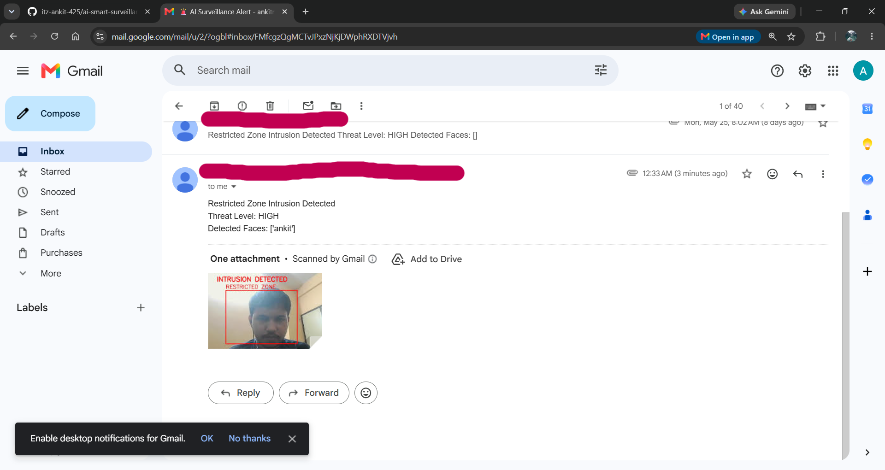
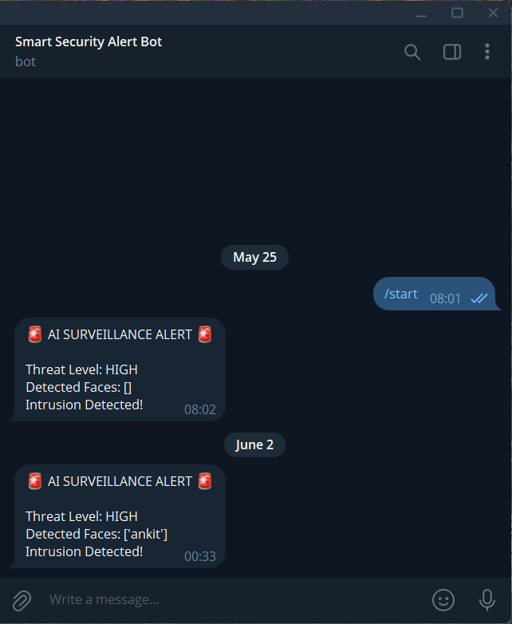

# 🛡️ AI Smart Surveillance System

An AI-powered surveillance and threat detection platform that combines Computer Vision, Facial Recognition, Real-Time Monitoring, and Automated Alerting to enhance security in restricted areas.

The system detects intrusions, identifies known and unknown individuals, captures evidence, maintains alert history, and instantly notifies administrators through Email and Telegram.

> ⚠️ This project is currently under active development. New features and improvements are continuously being added.

---

## 🚀 Features

### 🎥 Real-Time Surveillance
- Live camera monitoring
- Continuous video feed streaming
- Real-time object detection

### 🚫 Restricted Zone Detection
- Customizable restricted area
- Intrusion detection inside protected zones
- Automatic threat classification

### 🧠 AI Object Detection
- Powered by YOLOv8
- Detects persons and objects in real time
- Fast and efficient inference

### 👤 Facial Recognition
- Recognizes registered individuals
- Detects unknown faces
- Stores snapshots of unidentified persons

### 🚨 Threat Analysis
- Threat level classification
- Intrusion detection alerts
- Incident tracking

### 📧 Email Notifications
- Automatic email alerts
- Screenshot attachment included
- Threat information in alert message

### 📱 Telegram Notifications
- Instant Telegram bot alerts
- Real-time threat updates
- Remote monitoring capability

### 📸 Evidence Collection
- Automatic screenshot capture
- Alert history storage
- Incident image archive

### 📊 Dashboard Monitoring
- Live monitoring dashboard
- Alert history panel
- Threat statistics
- System status indicators

---

## 🛠️ Tech Stack

### Frontend
- Next.js
- React
- Tailwind CSS
- TypeScript

### Backend
- Spring Boot
- Java
- REST APIs

### AI Service
- Python
- Flask
- YOLOv8
- OpenCV
- Face Recognition

### Notification Services
- Gmail SMTP
- Telegram Bot API

---

## 🏗️ System Architecture

```text
Camera Feed
     │
     ▼
AI Detection Service (Flask + YOLOv8)
     │
     ├── Object Detection
     ├── Face Recognition
     ├── Threat Analysis
     │
     ▼
Spring Boot Backend
     │
     ▼
Next.js Dashboard
     │
     ├── Live Feed
     ├── Alert History
     ├── Threat Monitoring
     │
     ├── Email Alerts
     └── Telegram Alerts
```

---

## 📸 Project Screenshots

### Dashboard



### Email Alert



### Telegram Alert



---

## 📂 Project Structure

```text
AI-Surveillance-System/
│
├── frontend/                 # Next.js Frontend
│
├── backend/                  # Spring Boot Backend
│
├── ai-service/
│   ├── known_faces/
│   ├── unknown_faces/
│   ├── screenshots/
│   ├── app.py
│   └── yolov8n.pt
│
├── assets/
│   ├── dashboard.png
│   ├── email-alert.png
│   └── telegram-alert.png
│
└── README.md
```

---

## ⚙️ Environment Variables

Create a `.env` file inside the AI service directory.

```env
EMAIL_ADDRESS=your_email@gmail.com
EMAIL_PASSWORD=your_gmail_app_password

TELEGRAM_BOT_TOKEN=your_bot_token
TELEGRAM_CHAT_ID=your_chat_id
```

---

## ▶️ Running the Project

### 1. Clone Repository

```bash
git clone https://github.com/itz-ankit-425/ai-smart-surveillance-system.git
cd ai-smart-surveillance-system
```

### 2. Start Backend

```bash
cd backend
mvn spring-boot:run
```

### 3. Start AI Service

```bash
cd ai-service
pip install -r requirements.txt
python app.py
```

### 4. Start Frontend

```bash
cd frontend
npm install
npm run dev
```

---

## 🔒 Security Notes

- Sensitive credentials are stored using environment variables.
- Telegram Bot Token is not exposed in source code.
- Gmail App Password is not committed to GitHub.
- `.env` file is ignored using `.gitignore`.

---

## 🎯 Future Enhancements

- Multi-camera support
- Cloud deployment
- SMS notifications
- WhatsApp integration
- Advanced analytics dashboard
- Face registration portal
- AI behavior analysis
- Motion tracking
- Database optimization
- User role management
- Mobile application

---

## 👨‍💻 Author

**Ankit Mondal**

B.Tech CSE Student  
Meghnad Saha Institute of Technology, Kolkata

GitHub:
https://github.com/itz-ankit-425

---

## ⭐ Project Status

🚧 Under Development

This project is actively being enhanced with new AI capabilities, security features, and monitoring functionalities.